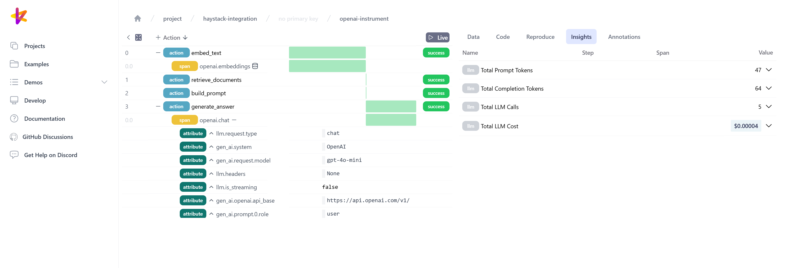

### **Table of Contents**

- [Overview](#overview)
- [Installation](#installation)
- [Usage](#usage)

## Overview

**Burr** is an open-source Python framework for building applications that make
decisions (chatbots, agents, simulations, etc.). **Burr UI** is its open-source,
free, and local-first companion app for monitoring, debugging, annotating, and more.

This extension lets you use your Haystack components (native, integrations, and custom)
to create Burr agents. Burr offers flexibility to manage the state of your agent
(i.e., memory) and define conditional logic to select its next action.

This release [blog post](https://blog.dagworks.io/p/build-llm-agents-faster-with-haystack)
further details the benefits of the Haystack + Burr integration. 
See this notebook tutorial for a full example
([GitHub](https://github.com/DAGWorks-Inc/burr/blob/main/examples/haystack-integration/notebook.ipynb),
[Google Colab](https://colab.research.google.com/github/DAGWorks-Inc/burr/blob/main/examples/haystack-integration/notebook.ipynb)
)



## Installation

```bash
pip install "burr[haystack]"
```

## Usage
### Creating an `action`

In Burr, your agent or `Application` is constituted of `action`s and `transition`s.
The default approach to define an action is to use the `@action` decorator. The 
`reads` and `writes` arguments specify which values can be read from and written to
state. Also, the decorated function must have a `State` as the first argument and
return a `State` with the updated values. 

```python
from burr.core import action, State

@action(reads=["documents"], writes=["prompt"])
def build_prompt(state: State, user_input: str) -> State:
    documents = state["documents"]
    # build prompt
    prompt = ...
    return state.update(prompt=prompt)
```

### Using the `HaystackAction`

The Haystack + Burr integration adds the `HaystackAction` class to simplify
defining an action from a Haystack `Component`. You can instantiate it by passing
the component, the name of the action, and the `reads` and `writes` arguments.
With `HaystackAction` supporting custom `Component`, this gives you a lot of
flexibility.

```python
from burr.integrations.haystack import HaystackAction
from haystack.components.builders import PromptBuilder

build_prompt = HaystackAction(
    component=PromptBuilder(
        template="Document: {{documents}} Question: {{question}}"
    ),
    name="build_prompt",
    reads=["documents"],
    writes=["prompt"],
)
```

### Building an `Application` (i.e., agent)

To create the `Application`, you give all your actions to the `ApplicationBuilder`
in the `.with_actions()` clause and specify the transitions between actions as 
tuples of action names. You can mix and match regular `@action` and `HaystackAction`
in the same application. Then, you need to set an entrypoint, i.e., where to 
start the application. Use `.run()` with a halting condition to launch the
application.


```python
from burr.core import ApplicationBuilder
from burr.integrations.haystack import HaystackAction

embed_text = HaystackAction(name="embed_text", ...)
retrieve_documents = HaystackAction(name="retrieve_documents", ...)
build_prompt = HaystackAction(name="build_prompt", ...)
generate_answer = HaystackAction(name="generate_answer", ...)
display_answer = HaystackAction(name="display_answer", ...)

app = (
    ApplicationBuilder()
    .with_actions(
        embed_text,
        retrieve_documents,
        build_prompt,
        generate_answer,
        display_answer,
    )
    .with_transitions(
        ("embed_text", "retrieve_documents"),
        ("retrieve_documents", "build_prompt"),
        ("build_prompt", "generate_answer"),
        ("generate_answer", "display_answer"),
    )
    .with_entrypoint("embed_text")
    .build()
)

app.run(halt_after=["display_answer"])
```

### Converting a Haystack `Pipeline`

If you want to run an existing Haystack `Pipeline` with Burr, you can convert it
at once using the function `haystack_pipeline_to_burr_graph()`. This will create
a Burr `Graph` which you can pass to the `ApplicationBuilder` instead of specifying
actions and transitions individually.

```python
from haystack import Pipeline
from burr.integrations.haystack import haystack_pipeline_to_burr_graph

# define your Haystack Pipeline
pipeline = Pipeline()

# add components
pipeline.add_component(...)
pipeline.add_component(...)

# connect components
pipeline.connect(...)

# ...

graph = haystack_pipeline_to_burr_graph(pipeline)
app = (
    ApplicationBuilder()
    .with_graph(graph)
    .with_entrypoint("embed_text")
    .build()
)
```

### Adding telemetry and monitoring

Via the `ApplicationBuilder`, you can instrument your application to prepare it
for production. Here are some key features:

- `.with_tracker()`: log execution to the Burr UI. This is compatible with
OpenTelemetry, including the Haystack integrations (OpenLLMetry, OpenInference),
and all other supported LLM-related libraries (LLM APIs, vector databases, etc.)
- `.with_state_persister()`: store on disk the `State` of your application and 
resume later. This helps build your product (e.g., create user sessions), but
also helps develop, debug, and test your application.
- `.with_hooks()`: add custom logic on action execution (e.g., send a Slack
notification under certain conditions).

By enabling the tracker, you're also able to annotate tracked data to curate
datasets, create tests, and more.
