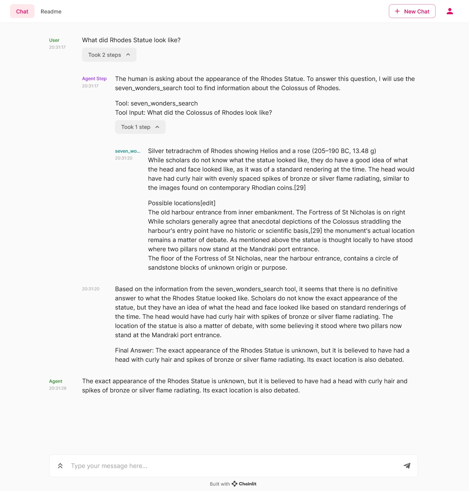

# Chainlit

Chainlit is an open-source Python package that makes it incredibly fast to build, test and share LLM apps. Integrate the Chainlit API in your existing code to spawn a ChatGPT-like interface in minutes. With a simple line of code, you can leverage Chainlit to interact with your agent, visualise intermediary steps, debug them in an advanced prompt playground and share your app to collect human feedback. More info on the [documentation](https://docs.chainlit.io/).



# Installation

```
pip install chainlit
```

# Integration

This code adds the Chainlit callback handler to the Haystack callback manager. The callback handler is responsible for listening to the chain’s intermediate steps and sending them to the UI.

```python
from haystack.agents.conversational import ConversationalAgent
import chainlit as cl

## Some code

agent = ConversationalAgent(
  prompt_node=conversational_agent_prompt_node,
  memory=memory,
  prompt_template=agent_prompt,
  tools=[search_tool],
)
cl.HaystackAgentCallbackHandler(agent)
```


## Example
Check out this full example from the cookbook: https://github.com/Chainlit/cookbook/tree/main/haystack

## About Chainlit
Chainlit is an open-source Python package that makes it incredibly fast to build, test and share LLM apps. Integrate the Chainlit API in your existing code to spawn a ChatGPT-like interface in minutes!

### Key features
- Build LLM Apps fast: Integrate seamlessly with an existing code base or start from scratch in minutes
- Visualize multi-steps reasoning: Understand the intermediary steps that produced an output at a glance
- Iterate on prompts: Deep dive into prompts in the Prompt Playground to understand where things went wrong and iterate
- Collaborate with teammates: Invite your teammates, create annotated datasets and run experiments together
- Share your app: Publish your LLM app and share it with the world (coming soon)
