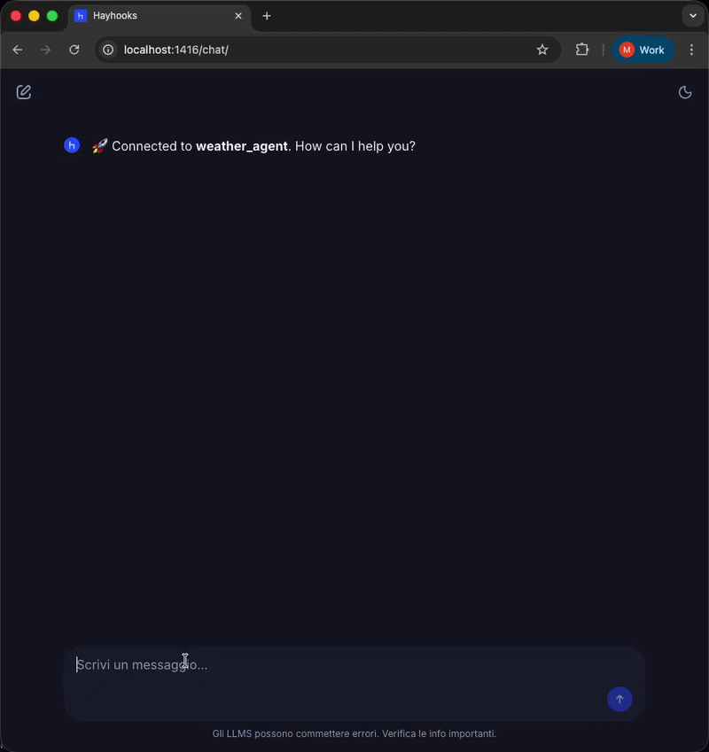

### Table of Contents

- [Overview](#overview)
- [Installation](#installation)
- [Usage](#usage)
- [License](#license)

## Overview

[Chainlit](https://chainlit.io/) is an open-source Python package for building 
production-ready Conversational AI. By exposing your Haystack app (standalone agent or 
pipeline) through [Hayhooks](https://github.com/deepset-ai/hayhooks) as 
OpenAI-compatible endpoints, you can run the Chainlit chat UI inside your Hayhooks 
server, giving you a zero-configuration frontend to interact with your deployed 
pipelines without a separate client. 

For full details, see the [Hayhooks Chainlit integration guide](https://deepset-ai.github.io/hayhooks/features/chainlit-integration).

## Installation

Install Hayhooks with the `chainlit` extra:

```bash
pip install "hayhooks[chainlit]"
```

## Usage

### Hayhooks Quick Start

The simplest way to enable the Chainlit UI is via the `--with-chainlit` flag:

```bash
hayhooks run --with-chainlit
```

This starts Hayhooks with the embedded Chainlit UI available at `http://localhost:1416/
chat`.

### Create a Pipeline Wrapper

```python
# pipelines/my_chat/pipeline_wrapper.py
from typing import Generator

from haystack import Pipeline
from haystack.components.builders import ChatPromptBuilder
from haystack.components.generators.chat import OpenAIChatGenerator
from haystack.dataclasses import ChatMessage

from hayhooks import BasePipelineWrapper, streaming_generator

class PipelineWrapper(BasePipelineWrapper):
    def setup(self) -> None:
        self.system_message = ChatMessage.from_system("You are a helpful assistant.")
        chat_prompt_builder = ChatPromptBuilder()
        llm = OpenAIChatGenerator(model="gpt-4o-mini")

        self.pipeline = Pipeline()
        self.pipeline.add_component("chat_prompt_builder", chat_prompt_builder)
        self.pipeline.add_component("llm", llm)
        self.pipeline.connect("chat_prompt_builder.prompt", "llm.messages")

    def run_chat_completion(self, model: str, messages: list[dict], body: dict) -> Generator:
        chat_messages = [self.system_message] + [
            ChatMessage.from_openai_dict_format(msg) for msg in messages
        ]
        return streaming_generator(
            pipeline=self.pipeline,
            pipeline_run_args={"chat_prompt_builder": {"template": chat_messages}},
        )
```

Pipelines must support chat completion (e.g. using `streaming_generator` or `async_streaming_generator`). See [OpenAI compatibility](https://deepset-ai.github.io/hayhooks/features/openai-compatibility) and the [pipeline examples](https://deepset-ai.github.io/hayhooks/examples/overview/) for implementation details.

### Run Hayhooks with UI

```bash
hayhooks run --with-chainlit --pipelines-dir ./pipelines
```

Navigate to [`http://localhost:1416/chat`](http://localhost:1416/chat) in your browser. You'll see your deployed pipeline and can start chatting!



### Examples
Learn how to build an end-to-end agent example with Haystack, Hayhooks and Chainlit in [Chainlit Weather Agent Example](https://github.com/deepset-ai/hayhooks/tree/main/examples/pipeline_wrappers/chainlit_weather_agent)

## License

`hayhooks` and `chainlit` are distributed under the terms of the [Apache-2.0](https://spdx.org/licenses/Apache-2.0.html) license.
